<p align="center">
  
</p>
<p align="center">
  
</p>
<p align="center">
  
</p>

[](https://github.com/DEkeiser-Dev)

[](https://www.youtube.com/channel/UC9P0w-mYzcRmdUkDf2m0jTg/)
[](https://play.google.com/store/apps/dev?id=7541824526812591073)

## 🧑‍💻 Sobre mí

<!-- Aquí puedes escribir tu presentación después -->

Me interesa crear proyectos combinando **programación, arte 2D/3D, animación y desarrollo de videojuegos**.

Actualmente estoy trabajando en proyectos personales y aprendiendo constantemente nuevas herramientas y tecnologías.

Desarrollo aplicaciones y proyectos para **Android, PC y Linux**.

<p align="center">
  
</p>

## 🛠️ Tecnologías y herramientas

<h2>💻 Programación</h2>

<p align="left">
  <a href="https://skillicons.dev">
    
  </a>
</p>

<h2>🎮 Desarrollo</h2>

<p align="left">
  <a href="https://skillicons.dev">
    
  </a>
</p>

<h2>🎨 Arte y 3D</h2>

<p align="left">
  <a href="https://skillicons.dev">
    
  </a>
  
</p>

<p align="center">
  
</p>

## 📊 GitHub Stats

[](https://git.io/streak-stats)

<p align="center">
  
</p>

## 🚀 Proyectos destacados

### 🖱️ ClickSpeed CPS Test

Aplicación para medir la velocidad de clics por segundo (CPS), desarrollada con Godot para Android.

- 🎮 Modos de juego para uno y varios jugadores
- 🌎 Sistema de traducciones
- 📱 Optimizada para dispositivos Android
- 🔊 Efectos de sonido y música
- 📈 Estadísticas de rendimiento

🔗 [Ver proyecto en GitHub](https://github.com/DEkeiser-Dev/Click_Speed)

---

<p align="center">
  
</p>

### 💜 Gracias por visitar mi perfil

```text
Code • Create • Animate • Repeat
